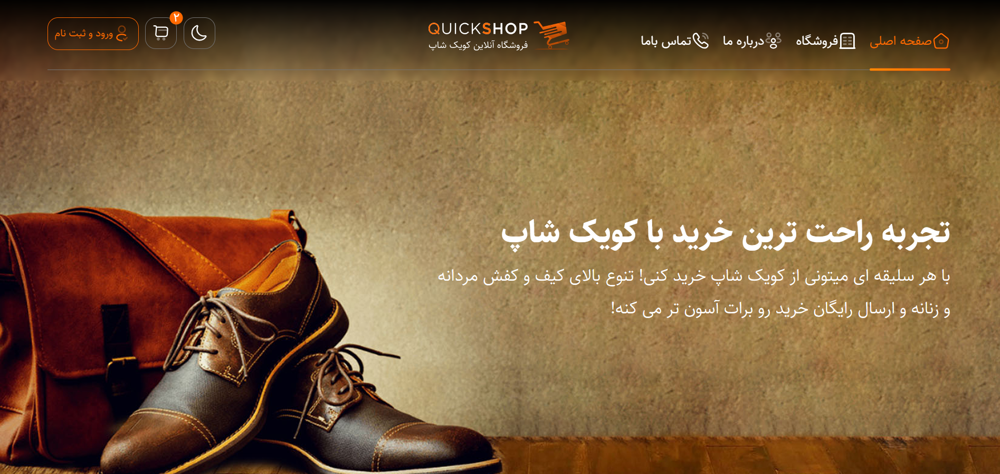

# 🛍️ QuickShop Landing Page

> A modern, fully responsive, and feature-rich landing page for an online shoe and bag store.

This project is a **frontend landing page** designed with the goal of **practicing and mastering Tailwind CSS v4, building complex UI components, and implementing a seamless Dark Mode**.

---

## 📌 Project Overview

In this project, a comprehensive e-commerce landing page for "QuickShop" has been designed and implemented. 

The main focus of the project was on **crafting a modern UI, implementing a seamless Dark Mode (using LocalStorage and system preferences), ensuring full responsiveness (Mobile-first), and creating a beautiful RTL (Right-to-Left) layout suitable for Persian users**.

---

## ✨ Features

- 🎨 Modern UI design with a sleek dark/light theme.
- 📱 Fully responsive layout across mobile, tablet, and desktop.
- 🌙 Dark Mode toggle synced with LocalStorage and system preferences.
- 🇮🇷 Complete RTL (Right-to-Left) layout optimized for Persian language.
- 🛒 Interactive components: Mobile navigation drawer, mobile shopping cart, and product cards.
- 🎞️ Interactive product sliders and blog section powered by Swiper.js.
- 📍 Complete footer with contact info, social media icons, and an embedded Google Map.

---

## 🛠️ Tech Stack

- **HTML5**
- **Tailwind CSS v4** (via CLI)
- **JavaScript (Vanilla)**
- **Swiper.js** (for sliders)
- **Node.js & npm** (for the build process)
- **Google Maps Embed API**

---
## 📂 Project Structure

*Note: The `node_modules` directory is ignored via `.gitignore`.*

```text
QuickShop_TailwindCSS/
│
├── public/                     # Compiled, production-ready files
│   ├── fonts/
│   │   └── sahel/              # Persian Sahel font family (Woff2)
│   ├── imgs/                   # Project images, SVGs, and icons
│   ├── js/
│   │   ├── app.js              # Main logic (Dark mode, menus, cart)
│   │   └── swiper-bundle.min.js
│   ├── styles/
│   │   ├── app.css             # Compiled Tailwind CSS output
│   │   └── swiper-bundle.min.css
│   └── index.html              # Main HTML file
│
├── src/
│   └── input.css               # Tailwind CSS v4 source file 
│
├── .gitignore                  # Git ignore rules
├── package.json                # Dependencies and npm scripts
├── package-lock.json           # Exact dependency tree
└── README.md                   # Project documentation
```

## 🖼️ Preview


---

## 📚 Project Goals

This project was built with the goal of **improving frontend development skills and deeply learning Tailwind CSS v4**. 

During the development process, the main focus was on:
- Translating a complex Figma/design concept into clean, responsive code.
- Utilizing Tailwind's utility classes and customizing the theme (custom fonts, child selectors).
- Managing responsive layouts (Grid and Flexbox) across various breakpoints.
- Implementing a robust Dark Mode using JavaScript and Tailwind's `dark:` variant.
- Mastering RTL design principles in Tailwind.

---

## 📈 What I Learned

Throughout this project, I gained hands-on experience with:
- Setting up and configuring Tailwind CSS v4 via the CLI.
- Using the `@custom-variant` and `@theme` directives in Tailwind v4.
- Implementing a seamless Dark Mode toggle using `localStorage` and `window.matchMedia`.
- Integrating and customizing third-party libraries like Swiper.js for touch-friendly sliders.
- Building accessible and interactive mobile menus and shopping cart drawers.
- Writing clean, maintainable, and scalable HTML structure.

---

## 🔮 Future Improvements

In future versions, the following features could be added:
- Adding dedicated internal pages (Product Details, Checkout, Blog Post).
- Integrating a real backend API to fetch products dynamically.
- Adding subtle micro-animations to product cards and sliders.
- Implementing a full shopping cart logic with state management.

---
## 🚀 Getting Started

### Prerequisites

Before running the project, make sure you have **Node.js** and **npm** installed on your system.

### Installation

1. Clone the repository:

```bash
git clone https://github.com/mohammadghasemi2025/QuickShop-TailwindCSS
```

2. Navigate to the project directory:

```bash
cd QuickShop-TailwindCSS
```

3. Install the project dependencies:

```bash
npm install
```

### Development

To start Tailwind CSS in watch mode and automatically compile changes:

```bash
npm run build
```

The generated CSS file will be available at:

```text
public/styles/app.css
```

## 👨‍💻 Developer

**Mohammad Ghasemi Shervedani**

- GitHub: [@mohammadghasemi2025](https://github.com/mohammadghasemi2025)
- LinkedIn: [Mohammad Ghasemi Shervedani](https://www.linkedin.com/in/mohammadghasemi2025/)

---

## 📄 License

This project was created for **educational and practice purposes**. Feel free to use it to learn and build upon!